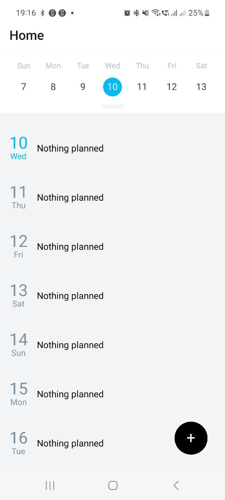
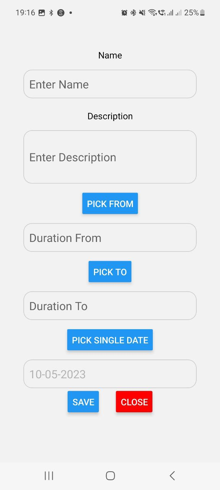
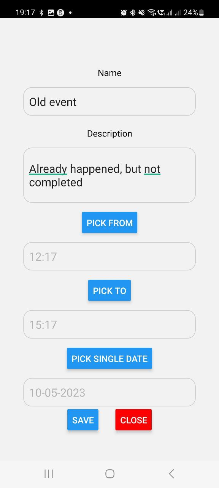
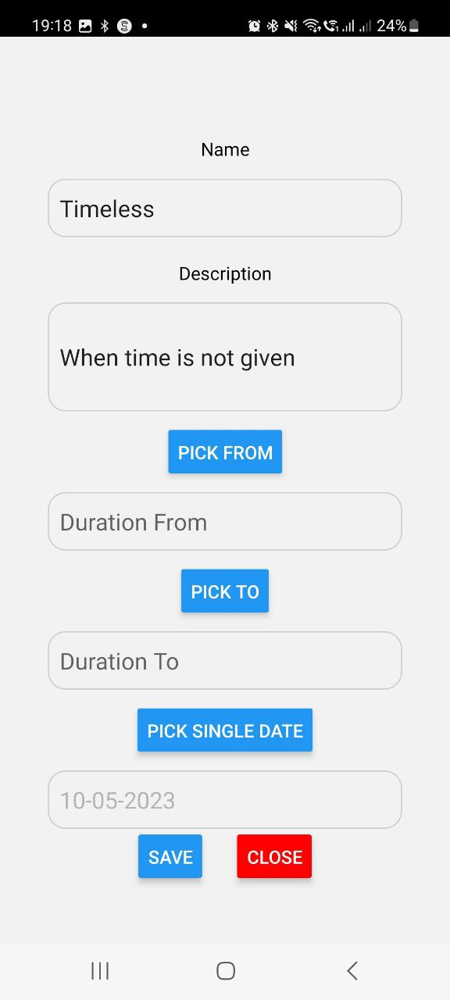
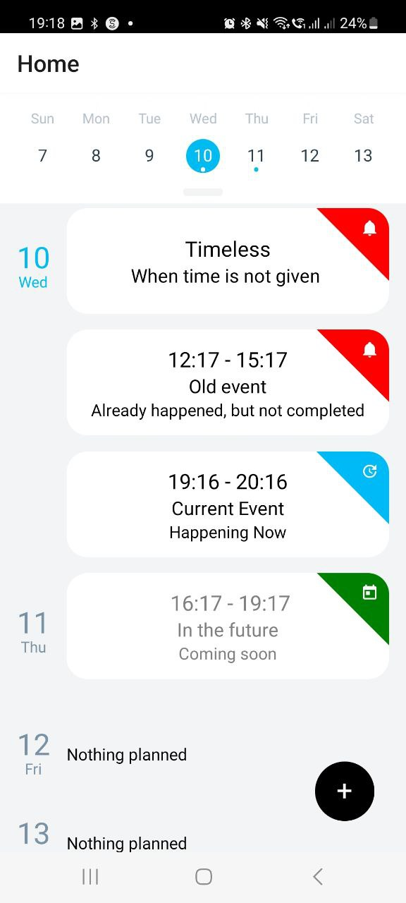

# Daily

## Overview

This code defines a HomeScreen component in a React Native application. The component is responsible for displaying a calendar-like interface with events and allows users to add, edit, and delete events.

## Install

### Prerequisites

1. Node
2. Expo
3. Npm


### Run

```bash 
npm install
```

```bash 
npm start 
```

# Screens

### Main Page



### Add new event



### Time passed event



### Timeless event (when no time is provided)



### Final View




